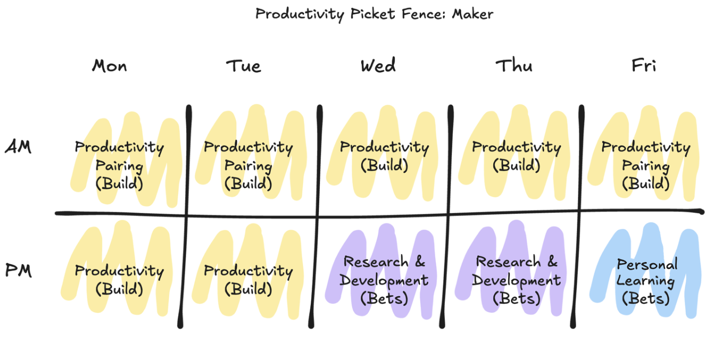

# The Productivity Picket Fence: A Practical Framework for Time Allocation

Professional productivity isn't just about maximizing output—it's about creating a sustainable balance between immediate work, continuous learning, and personal growth. This framework, called the Productivity Picket Fence (named for the visual pattern it creates when diagrammed), offers a straightforward approach to organizing your professional time.

## The Basic Structure: Ten Four-Hour Periods

The framework divides your workweek into ten distinct periods:
- Two periods per day (morning and afternoon)
- Five workdays per week
- Each period is roughly four hours

Four-hour blocks serve as the smallest practical unit for meaningful professional work, allowing enough time for deep focus while maintaining flexibility in your schedule.

## Three Core Components of Professional Time

### Production Time (7 Periods - 70%)
The majority of your workweek—seven periods—is dedicated to your core responsibilities and deliverables. Within these production periods:
- Four periods for independent work
- Three periods for active collaboration with teammates
- This balance ensures both focused individual contribution and effective team alignment

### Organizational Learning (2 Periods - 20%)
Two periods are devoted to manager-directed research and study. This isn't about immediate deliverables—it's about investing in future capabilities:
- Exploring new methodologies or technologies
- Studying industry trends
- Developing specific skills needed for upcoming projects
- Making small, calculated bets on future organizational needs

### Personal Growth (1 Period - 10%)
One period is allocated to self-directed learning or development. This time is yours to:
- Explore professional interests
- Develop adjacent skills
- Study topics that engage you personally
- Build capabilities that might benefit your work in unexpected ways

## Implementation Guidelines

1. **Schedule Deliberately**
   - Block out your periods at the start of each week
   - Protect your personal growth and learning time—it's not overflow for production work
   - Align collaborative periods with team availability

2. **Maintain Flexibility**
   - Adjust period ordering to match your team's natural rhythm
   - Swap period types when necessary, but maintain the overall balance across weeks
   - Account for team meetings and external commitments in your planning

3. **Track and Adjust**
   - Monitor how well you maintain the intended time allocation
   - Note which activities fall into each category
   - Review and adjust your classification of activities as needed

## Measuring Effectiveness

The success of this framework can be evaluated through:
- Completion of core deliverables
- Application of new learning to work problems
- Quality of team collaboration
- Professional growth over time
- Work satisfaction and engagement

## Getting Started

Begin implementing this framework by:
1. Auditing your current time allocation
2. Identifying activities for each category
3. Setting up initial period blocks in your calendar
4. Communicating the structure to your team
5. Starting with a test week to refine your approach

Remember that the goal isn't perfect adherence to these time blocks, but rather to ensure a balanced investment in immediate productivity, organizational learning, and personal growth. This structured approach helps prevent the common pattern of sacrificing learning and development for short-term output.
